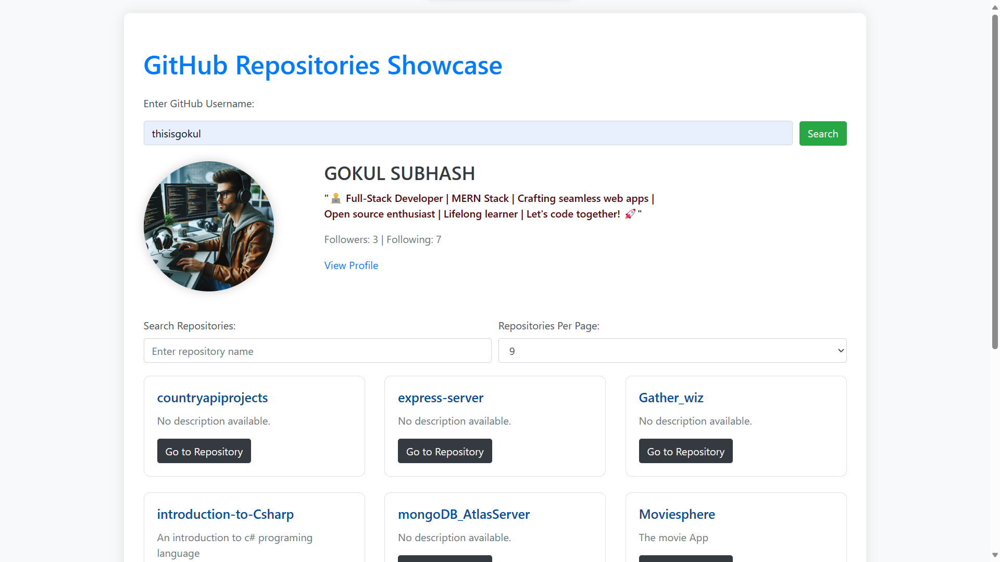

# GitHub Repositories Showcase

GitHub Repositories Showcase is a web application developed using HTML, CSS, JavaScript, and Bootstrap. It allows users to explore GitHub repositories based on a username. The project aims to provide a simple and interactive interface for viewing user profiles and repositories on GitHub.

## Features

- **User Profile Display:** View the user's profile information, including their avatar, name, bio, followers, and following.

- **Repository Showcase:** Display a paginated list of repositories for the given GitHub username.

- **Search Repositories:** Search for specific repositories based on their names.

- **Pagination:** Navigate through the user's repositories with a simple pagination feature.

- **Dark Mode:** Enjoy a dark mode for a more comfortable browsing experience.

## Usage

1. Enter a GitHub username in the provided input field.
2. Click the "Search" button or press Enter to fetch and display the user's information and repositories.
3. Explore the user's profile, repositories, and use the search and pagination features.

## Screenshots

*Caption for Screenshot 1.*

*Caption for Screenshot 2.*

## Getting Started

1. Clone the repository: `git clone https://github.com/thisisgokul/github-Gitreposhowcase.git`
2. Open `index.html` in your web browser.

## Technologies Used

- HTML
- CSS
- JavaScript
- [Bootstrap](https://getbootstrap.com/)

## Dependencies

- [GitHub API](https://developer.github.com/v3/)

